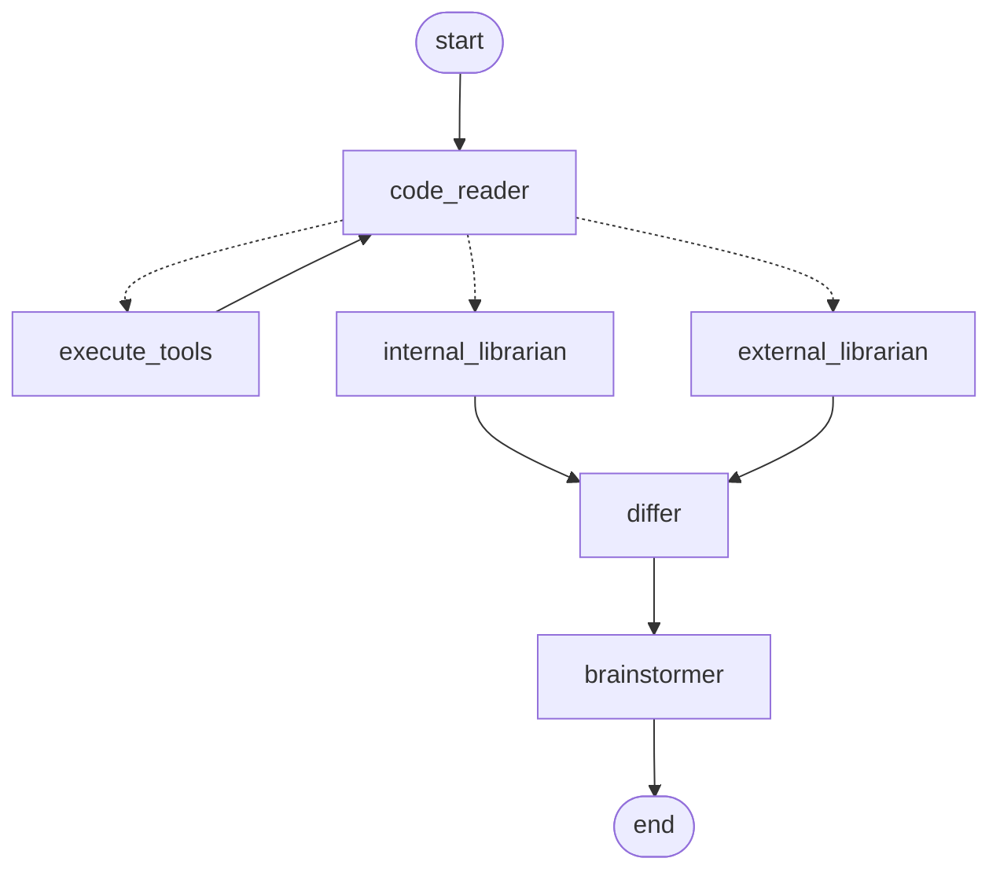

# Agentic Research

A multi-agent system that compares **what your project does** (its code and internal docs) with
**the state of the art** (a library of papers), and proposes where to go next.

Ask a question such as *"Our recall is stuck, what does the literature do differently and what should
we try first?"* and the agents:

1. **Code reader** explores your codebase with [Serena](https://github.com/oraios/serena) (read-only code navigation tools).
2. **Internal librarian** retrieves your project docs, keeping what is in production (`current`) apart from past attempts (`historical`, `superseded`).
3. **External librarian** retrieves relevant excerpts from your paper library.
4. **Differ** compares the project with the literature, tagging every internal claim as `[current]` or `[historical]`.
5. **Brainstormer** turns the comparison into ideas and next steps, ranked by expected impact, without re-proposing approaches that already failed.



Built with [LangGraph](https://github.com/langchain-ai/langgraph), Chroma for retrieval, and
[LangSmith](https://smith.langchain.com) for tracing and evaluation.

## Setup

Requires Python 3.11+ and [uv](https://docs.astral.sh/uv/) (used to run Serena on demand).

```bash
python -m venv .venv
.venv/Scripts/activate            # Windows; on macOS/Linux: source .venv/bin/activate
pip install -e ".[dev]"           # or: pip install -e .   (without the eval and development tools)
cp .env.example .env              # then fill in your keys and paths
```

Serena needs no separate install: it is launched with `uvx` (a pinned version, downloaded on first use).
To use an existing Serena installation instead, set `SERENA_COMMAND=serena` in `.env`.
Serena stores its settings in a `.serena/` folder inside the analyzed codebase.

## Build the knowledge base

Put your project docs (`.md`, `.txt`, `.pdf`) in one folder and your papers in another (for example
`data/docs/` and `data/papers/`; `data/` is gitignored), then ingest them:

```bash
python scripts/ingest.py --document_directory data/docs   --vector_store_path path/to/vector_store/internal
python scripts/ingest.py --document_directory data/papers --vector_store_path path/to/vector_store/external
```

`VECTOR_STORE_DIR` in `.env` must point to the folder holding `internal/` and `external/`. Chroma
can't load stores from paths with non-ASCII characters, so keep that path ASCII-only. Re-running
ingest keeps a store in sync with its folder: changed files are updated (never duplicated) and deleted
files are removed.

To separate production from past attempts, give internal docs a `status` in their front matter
(docs without one count as `current`):

```markdown
---
status: current      # or: historical, superseded, retracted (retracted docs are never retrieved)
---
```

## Run

```bash
streamlit run app.py                         # web UI: live agent outputs, sources with status badges, token usage
python main.py "What should we try first?"   # command line
```

Every finished run is recorded in `research_history.jsonl` (override with `RESEARCH_HISTORY_PATH`) and
listed in the UI sidebar. The history is a record only: it is never fed back into the agents.

## Configuration

- `agentic_research/config.py`: the model and token limits of every agent. Models use LangChain's
  `provider:model` format (e.g. `openai:gpt-5.4-mini`, `google_genai:gemini-3.6-flash`), so any
  provider supported by `init_chat_model` works once its integration package is installed
  (e.g. `pip install -e ".[google]"`).
- `RESEARCH_DOMAIN` in `.env`: the field the agents act as experts in.
- `agentic_research/prompts.py`: the agents' prompts.
- `agentic_research/tools/mcp_loader.py`: which Serena tools the code reader may use (read-only by default).

## Evaluation

`evals/` holds a LangSmith evaluation suite built on a fictional research project, measuring retrieval
recall, groundedness, conclusion coverage and whether past attempts are kept apart from the current system.
See [evals/README.md](evals/README.md).

```bash
python -m evals.run_eval --limit 1
```

## Development

```bash
pytest                          # offline unit tests: no API keys, network or Serena needed
ruff check . && ruff format .   # lint and format
python -m scripts.draw_graph    # print the agent graph as Mermaid
```

CI (`.github/workflows/ci.yml`) runs the linter, the format check and the tests on every push.

## Project layout

```
agentic_research/         the package
  config.py               models, token limits, research domain
  graph.py                the LangGraph wiring
  runner.py               runs the graph, collects token usage, records the run
  nodes/                  one file per agent
  tools/                  Serena loader, retrieval, research history, project map
  ingest.py               document ingestion into the vector stores
  prompts.py, state.py, llm.py, token_budget.py
app.py, main.py           entry points (web UI, CLI)
scripts/                  ingestion and graph-drawing CLIs
evals/                    evaluation suite and fictional fixtures
tests/                    unit tests
```

## License

[MIT](LICENSE)
